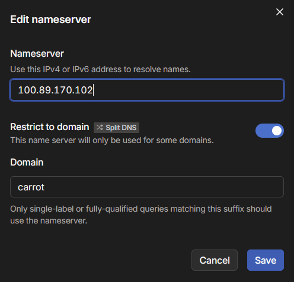

# tailscale-onion-proxy

This creates a tailscale-tor-proxy through which you can access the tor network.

``` bash
nano .env # add an auth-key from tailscale
docker compose up -d
```

After the first start you will see your tor-proxy in tailnet under https://login.tailscale.com/admin/machines.

Copy the tailscale-internal-IP of your tor-proxy and add it as TAILSCALE_IP to the .env file and do a docker compose up -d again so the dns service will resolve domains to the new IP.

``` bash
nano .env # add the tailscale ip of your new tor-proxy
docker compose up -d
```

Override your DNS server in tailscale to use your newly created node as a dns server for the carrot-domain https://tailscale.com/kb/1054/dns#override-dns-servers.




Now you can use your new tor-proxy!

Browser actively block you from accessing .onion sites, to get around this we use .carrot.
This should be totally transparent to the .onion site.

You can test it by accessing my blog http://simonja4fdp3lxdjeis5qjuugqe3wtbstlr2w7gmzsrnhhkpctmbgead.carrot/blog

Your browser might warn you that the connection is insecure because it is using http but do not worry, tor does not use https but everything is still encrypted and secure https://en.wikipedia.org/wiki/Onion_routing!

## Explanation

There are 4 services:
1. tor - provides the access to the tor network
2. tailscale - provides the access to your tailnet
3. dns - resolves all .carrot domains to the IP of your tailscale tor-proxy node hosting a nginx reverse proxy
4. nginx - the reverse proxy that replaces .carrot with .onion in the header and sends the request to tor, in the response from tor occurrences of .onion get replaced with .carrot

credits to https://www.reddit.com/user/StatisticianMinute18/ for posting https://www.reddit.com/r/Tailscale/comments/1mm2mwd/access_to_tor_via_tailscale_exit_node_working_100/
